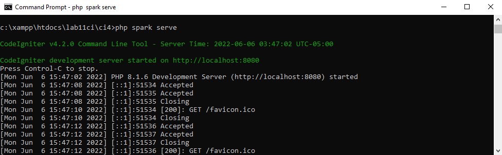

# Web11Lab11

**Nama    : Aning Kinanti** <br>
**NIM     : 312010364** <br>
**Kelas   : TI.20.A2** <br>
**Matkul  : Pemrograman Web** <br>

# Belajar PHP Framework (Codeigneter)
1. Konfigurasi Webserver dengan mengaktifkan beberapa ekstensi, mengaktifkan ekstentsi tersebut, melalu XAMPP Control Panel, pada bagian Apache klik Config -> PHP.ini. Pada bagian extention, hilangkan tanda ; (titik koma) pada ekstensi yang akan diaktifkan. Kemudian simpan kembali filenya dan restart Apache web server seperti dibawah ini : <br>
 <br>

2. Instalasi Codeigneter 4 dari website https://codeigniter.com/download.
Extrak file zip Codeigniter ke direktori htdocs/lab11ci.
Ubah nama direktory menjadi ci4. Buka browser dengan alamat http://localhost/lab11ci/ci4/public/
 <br>

3. Menjalankan CLI (Command Line Interface). Untuk mengakses CLI buka terminal/command prompt. Seperti dibawah ini : <br>
 <br>
 <br>

4. Mengaktifkan Mode Debugging untuk mengetahui pesan error apabila terjadi kesalahan dalam membuat kode program. Untuk memudahkan mengetahui jenis errornya, maka perlu diaktifkan mode debugging dengan mengubah nama file env menjadi .env kemudian buka file tersebut dan ubah nilai variable CI_ENVIRINMENT menjadi development.
Contoh error yang terjadi apabila mengubah kode pada file app/Controller/Home.php hilangkan titik koma pada akhir kode.
 <br>


## A. Program Sederhana Menggunakan Framework Codeigneter 4
### 1. Membuat Route Baru
Tambahkan kode berikut pada file `Routes.php` yang terletak pada `app/config/Routes.php` seperti contoh dibawah ini : <br>
```
$routes->get('/about', 'Page::about');
$routes->get('/contact', 'Page::contact');
$routes->get('/faqs', 'Page::faqs');
```
<br>

### 2. Membuat Controller
Buatlah file PHP baru dengan nama `Page.php` yang terletak pada `app/Controllers/Page.php` lalu isi dengan sintaks seperti contoh dibawah ini : <br>
```
<?php

namespace App\Controllers;

class Page extends BaseController
{
    public function about()
    {
       echo "Ini adalah halaman About";

    }

    public function contact()
    {
        echo "Ini adalah halaman Contact";

    }

    public function faqs()
    {
        echo "Ini adalah halaman Faqs";
    }
}
```
<br>

Selanjutnya coba akses dengan alamat url http://localhost:8080/about <br>
 <br>

### 3. Membuat View
Buatlah file PHP baru dengan nama `about.php` yang terletak pada `app/Views/about.php` lalu isi dengan sintaks seperti contoh dibawah ini : <br>
```
<!DOCTYPE html>
<html lang="en">
<head>
    <meta charset="UTF-8">
    <title><?= $title; ?></title>
</head>
<body>
    <h1><?= $title; ?></h1>
    <hr>
    <p><?= $content; ?></p>
</body>
</html>
```
<br>

Ubah method about pada class Controllers Page menjadi seperti berikut : <br>
```
public function about()
    {
        return view('about', [
            'title' => 'Halaman About', 
            'content' => 'Ini adalah paragraf yang menjelaskan tentang halaman about.'
        ]);
    }

```
<br>

Setelah halaman direfresh maka akan menjadi seperti dibawah ini : <br>
 <br>

### 4. Membuat Layout Web dengan CSS
Buatlah file CSS baru dengan nama `style.css` yang terletak pada `public` lalu isi dengan sintaks seperti contoh dibawah ini : <br>
```
/* RESET CSS*/
* {
    margin: 0;
    padding: 0;
}

body {
    line-height: 1;
    font-size: 100%;
    font-family: 'Open Sans', sans-serif;
    color: #5a5a5a;
}

#container {
    width: 980px;
    margin: 0 auto;
    box-shadow: 0 0 1em #ccc;
}

/* HEADER*/
header {
    padding: 20px;
}

header h1 {
    margin: 20px 10px;
    color: #a0a0a0;
}

/* NAV */
nav {
    display: block;
    background-color: #bebebe;
}

nav a {
    padding: 15px 30px;
    display: inline-block;
    color: #fff;
    font-size: 14px;
    text-decoration: none;
    font-weight: bold;
}

nav a.active,
nav a:hover {
    background-color: #0ca878;
}

/* HERO PANEL */
#hero {
    background-color: #e4e4e5;
    padding: 50px 20px;
    margin-bottom: 20px;
}

#hero h1 {
    margin-bottom: 20px;
    font-size: 35px;
}

#hero p {
    margin-bottom: 20px;
    font-size: 18px;
    line-height: 25px;
}

/* MAIN CONTENT */
#wrapper {
    margin: 0;
}

#main {
    padding-top: 25px;
    float: left;
    width: 640px;
    padding: 20px;
}

.row {
    padding-top: 50px;
}

.divider {
    border: 0;
    border-top: 1px solid #eee;
    margin: 40px 0;
}

/* ENTRY */
.entry {
    margin: 15px 0px;
}

.entry h2 {
    margin-bottom: 20px;
}

.entry p {
    line-height: 25px;
}

.entry img {
    float: left;
    border-radius: 5px;
    margin-right: 15px;
}

.entry .right-img {
    float: right;
    margin-left: 15px;
}

/* SIDEBAR AREA */
#sidebar {
    float: right;
    width: 260px;
    padding: 20px;
}

/* WIDGET */
.widget-box {
    border: 1px solid #eee;
    margin-bottom: 20px;
}

.widget-box .title {
    padding: 10px 16px;
    background-color: #0ca878;
    color: #fff;
}

.widget-box ul {
    list-style-type: none;
}

.widget-box li {
    border-bottom: 1px solid #eee;
}

.widget-box li a {
    padding: 10px 16px;
    color: #333;
    display: block;
    text-decoration: none;
}

.widget-box list-style:hover a {
    background-color: #eee;
}

.widget-box p {
    padding: 15px;
    line-height: 25px;
}

/* FOOTER */
footer {
    clear: both;
    background-color: #1d1d1d;
    padding: 20px;
    color: #eee;
}

/* BOX */
.box {
    display: block;
    float: left;
    width: 33.333333%;
    box-sizing: border-box;
    -moz-box-sizing: border-box;
    -webkit-box-sizing: border-box;
    padding: 0px 10px;
    text-align: center;
}

.box h3 {
    margin: 15px 0px;
}

.box p {
    line-height: 20px;
    font-size: 14px;
    margin-bottom: 15px;
}

.box img {
    border: 0;
    vertical-align: middle;

}

.image-circle {
    border-radius: 50%;
}

.row {
    margin: 0 -10px;
    box-sizing: border-box;
    -moz-box-sizing: border-box;
    -webkit-box-sizing: border-box;
}

.row:after, .row:before,
.entry:after, .entry:before {
 content:'';
 display:table;
}
.row:after,
.entry:after {
 clear:both;
}
```
<br>

### 5. Membuat File Header
Buatlah folder baru dengan nama `template` yang disimpan pada folder `app/Views`, lalu buat file PHP baru dengan nama `header.php` lalu isi dengan sintaks seperti contoh dibawah ini : <br>
```
<!DOCTYPE html>
<html lang="en">
<head>
    <meta charset="UTF-8">
    <title><?= $title; ?></title>
    <link rel="stylesheet" href="<?= base_url('/style.css');?>">
</head>
<body>
    <div id="container">
    <header>
        <h1>Layout Sederhana</h1>
    </header>
    <nav>
        <a href="<?= base_url('/');?>" class="active">Home</a>
        <a href="<?= base_url('/artikel');?>">Artikel</a>
        <a href="<?= base_url('/about');?>">About</a>
        <a href="<?= base_url('/contact');?>">Contact</a>      
    </nav>
    <section id="wrapper">
        <section id="main">
        
```
<br>

### 6. Membuat File Footer
Buatlah folder baru dengan nama `template` yang disimpan pada folder `app/Views`, lalu buat file PHP baru dengan nama `footer.php` lalu isi dengan sintaks seperti contoh dibawah ini : <br>
```
            </section>
            <aside id="sidebar">
                <div class="widget-box">
                    <h3 class="title">Widget Header</h3>
                    <ul>
                        <li><a href="#">Widget Link</a></li>
                        <li><a href="#">Widget Link</a></li>
                    </ul>
                </div>
                <div class="widget-box">
                    <h3 class="title">Widget Title</h3>
                    <p>Vestibulum lorem elit, iaculis in nisl volutpat, malesuada 
                        tincidunt arcu. Proin in leo fringilla, vestibulum mi porta, faucibus felis. 
                        Integer pharetra est nunc, nec pretium nunc pretium ac.</p>
                </div>
            </aside>
        </section>
        <footer>
            <p>&copy; 2022 - Universitas Pelita Bangsa</p>
        </footer>
    </div>
</body>
</html>
        
```
<br>

### 7. Membuat File About
Buatlah folder baru dengan nama `template` yang disimpan pada folder `app/Views`, lalu buat file PHP baru dengan nama `footer.php` lalu isi dengan sintaks seperti contoh dibawah ini : <br>
```
<!DOCTYPE html>
<html lang="en">
<head>
    <meta charset="UTF-8">
    <title><?= $title; ?></title>
</head>
<body>
    <?= $this->include('template/header'); ?>

    <h1><?= $title; ?></h1>
    <hr>
    <p><?= $content; ?></p>

    <?= $this->include('template/footer'); ?>
</body>
</html>      
```
<br>

Setelah halaman direfresh maka akan menjadi seperti dibawah ini : <br>
 <br>


